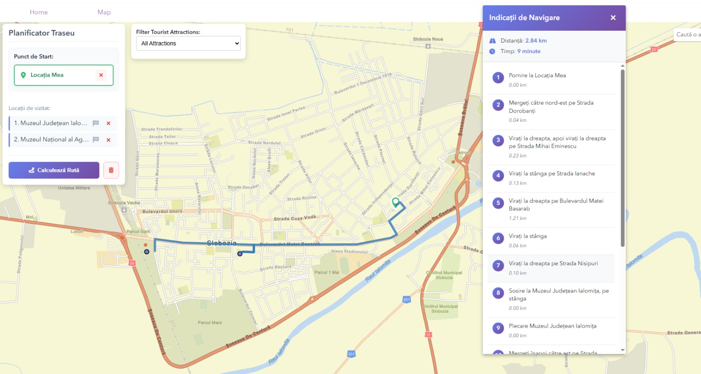

# RoRoute - Smart Travel & Itinerary Planner 🗺️🚗

**RoRoute** is an interactive web application designed for planning and optimizing travel itineraries in Romania. The platform simplifies the destination selection process by generating optimized routes based on user preferences (duration, group size, preferred attraction types).

---

## 📸 Route & Itinerary Optimization Demo

<!-- Insert your screenshot showing the optimal route and map paths here -->


---

## ✨ Key Features

- **Interactive Attractions Map:** Explore Romania's tourist spots with rich pop-ups displaying detailed descriptions, photos, and user ratings.
- **Preference Questionnaire:** Input journey preferences including party size, trip duration, target cities, and activity themes (architecture, nature, history, museums, etc.).
- **Optimal Route Calculation:** Backend routing logic computes the most efficient itinerary to minimize travel time and maximize sightseeing.
- **Review & Rating System:** Leave feedback, write comments, and rate visited attractions on a 1–5 star scale.
- **User Authentication & Profiles:** Secure Sign Up / Login system with personal profiles and preference management.

---

## 🛠️ Tech Stack & Architecture

The application adopts a decoupled client-server architecture:

- **Frontend:** Angular (TypeScript, Responsive UI)
- **Backend Service:** Flask (Python routing engine)
- **Database:** Firebase Realtime Database (Users, Cities, Attractions, Reviews)
- **GIS & Mapping:** ArcGIS JavaScript API & ArcGIS Online (Feature Layers, Graphics Layers, Routing & Search Services)
- **Security:** Password hashing via `bcrypt`

---

## 🚀 Getting Started

### Prerequisites
- [Node.js & npm](https://nodejs.org/) (for Angular CLI)
- [Python 3.x](https://www.python.org/) & `pip` (for Flask backend)

### Backend Setup (Flask)
```bash
cd backend
python -m venv venv

# Activate virtual environment
# Windows:
venv\Scripts\activate
# Linux/macOS:
source venv/bin/activate

pip install -r requirements.txt
python app.py
```

### Frontend Setup (Angular)
```bash
cd frontend
npm install
ng serve
```

Navigate to `http://localhost:4200/` in your browser.
